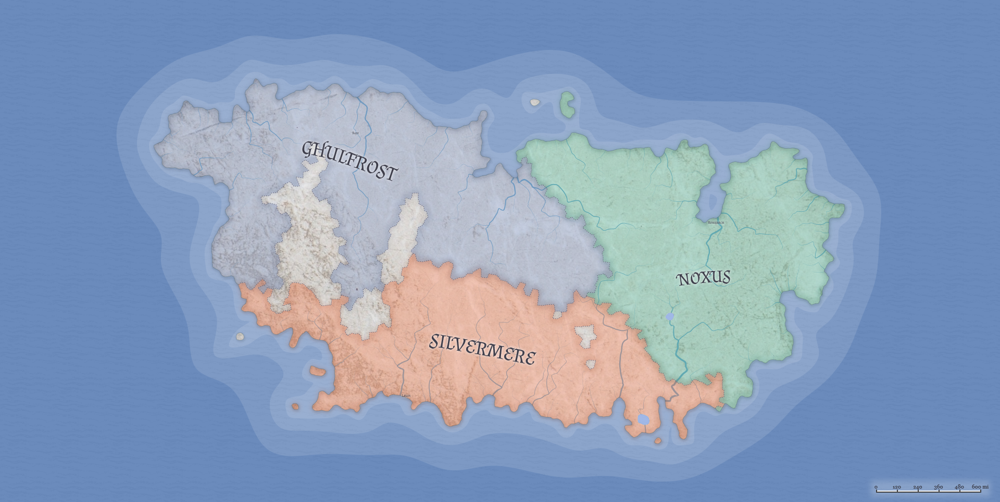

% Sandrikia's DnD Campaign 2

## შესავალი

სილვერმერის სამხედრო სამსახურმა ეპისკოპოს ენრიკოს სპეცდავალების შესასრულებლად
გამოაცხადა გაწვევა. გაწვეულთ სამი დღე ჰქონდათ, რათა გამოცხადებულიყვნენ ქალაქ
ედესის თავდაცვის შტაბში.

გასაუბრების შედეგად, რომელიც მოიცავდა როგორც ფიზიკურ, ასევე გონებრივ გამოცდას,
შეირჩა ხუთკაციანი რაზმი, რომელსაც დაევალა ქალაქ თერბისაში, პელორის სახელობის
ეკლესიაში გამგზავრება.

## სამყაროს მიმოხილვა

* სამყარო: ისგარდი
    * კონტინენტი: ტონსბერგი
        * ქვეყანა: სილვერმერი
            * ქალაქი: ედესა
        * ქვეყანა: ნოქსუსი
        * ქვეყანა: გულფროსტი

## სესიები 

- [სესია 0](sessions/session-0.html)
