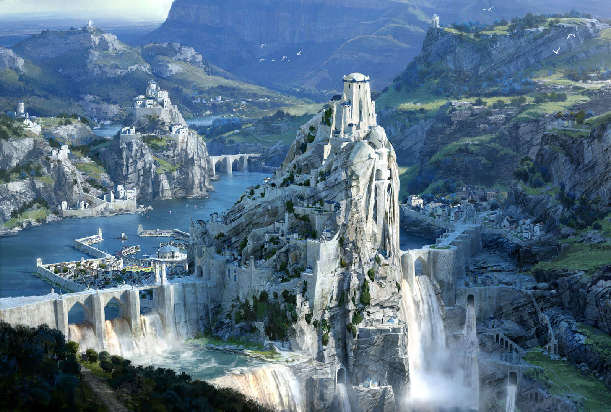
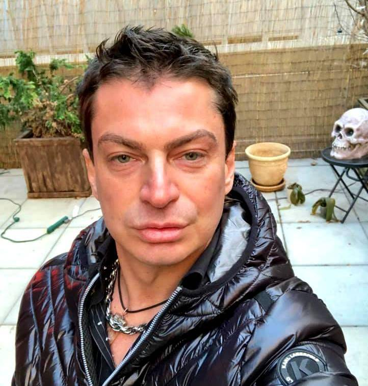

# სესია 0

## წინარეისტორია

ძველად გულფროსტის სახელმწიფო ფლობდა მთლიან ისგარდის კონტინენტს და მმართველი
მისი იყო ოლაფ I. 600 წლის წინ სხვა კონტინენტიდან მოსულმა ნოქსუსელებმა უძლეველი
ნივორლასის მეთაურობით ისგარდის აღმოსავლეთში გააშენეს კოლონიები და მალევე
მიითვისეს გულფროსტის მიწების ნახევარი. ოდესღაც დიდებული გულფროსტი ორ ნაწილად
დაიშალა. სუსხიანი კლიმატის გამო ქვეყანა დიად გასაჭირში ჩავარდა. ტერიტორიის
სანაცვლოდ უცხო კონტინენტზე გაშენებულ სილვერმერთან დადეს გარიგება 400 წლის წინათ.
ამ უკანასკნელის მოსახლეობა, შემდგარი ელფებისა და ადამიანების თანაბარი
რაოდენობისგან, ახლა მიიჩნევს, რომ ნახევრად ელფები წარმოადგენენ მომავლის რასას.
სილვერმერმა წაიღო კონტინენტის მესამედი, ნოქსუსმაც მესამედი და გულფროსტისგან
მხოლოდ მესამედიცღა დარჩა.

სილვერმერში თაყვანს სცემენ მხოლოდ პელორს, ღმერთს მზისა. აღსანიშნავია, რომ დიდ
ქალაქებში მაგია აკრძალულია, ხოლო ინდუსტრია — განვითარებული. როგორც ამბობენ,
ძველი დედაქალაქი ამით განადგურებულა ოდესღაცო. დაგროვილი მაგიური ენერგიით აწყობენ
ეგრეთ წოდებულ ცოცხალ მანქანებს, ლითონის ცხოველებს, რომლებიც ედესაში —
დედაქალაქში — მიმოდიან ხოლმე აქეთ-იქით. ნოქსუსში კი მაგია საგრძნობლად
განსხვავდება ყველაფერი ნაცნობისგან.

ამასობაში სილვერმერის კომისარიატში დაიწყეს თავგადასავლის მაძიებელთა დახარისხება
და სხვადასხვა მისიაზე გადამისამართება. განამწესეს ერთი ჯგუფი ერთ კარეტაში,
რამეთუ ქალაქ თერბისაში ვინმე ეპისკოპოსი ენრიკე დახმარებას ეძებდა. გზაში გჯუფის
წევრებმა ერთმანეთი გაიცნეს:

* **მამუ** — მაღალი, მაგრამ თავისი სიმაღლისთვის მაინც ზედმეტად განიერი,
  ოქროსფერი კონტურებით შელამაზებულ თეთრ აბჯარში გამოყობილი რაინდი. მისი ჩაფხუტი
  შორიდან წააგავდა სათლს, რომელსაც ცხვირ—პირის გამოსაჩენად გამოჭრილი ჰქონდა ჯვრის
  ფორმა. თვალები აბჯრის კონტურებივით ოქროსფერი, ხოლო ნიკაპი — გამოთლილი, როგორც
  კერპისა.
* **უსახელო ნახევარელფი** — მოგრძო თმა, უძილარი ჩაშავებული თვალები, უმკლავებო თეთრი
  მაისური, ტანზე რომ ხურჯინივით ეკიდა; შორტი და სანდლები, პლედი ზედ მოფარებული,
  ფეხებთან არფა მიდებული.
* **ბონდრიუდი** — შავაბჯრიანი საშუალო აღნაგობის კაცი, რომელსაც ზევიდან გრძელი
  ტყავის მოსასხამი ეცვა, ცალ ხელში ფარი ეჭირა, ქამარზე — ქარქაში.
* **მიკრი** — მოწითალო ლამაზი სამოსით გამოწყობილი, წელში ცოტა ზედმეტად
  გამართული, მომღიმარი სახით მჯდომი ახალგაზრდა მამაკაცი. სახე გულფროსტელისას
  ჰგავდა. მწვანე თვალები, მცირედით ამოწეული ყვრიმალები და მომრგვალებული ყბა.
* **ვაიკარი** — კუთხეში მიმჯდარი მამაკაცი. იმდენად მოხდენილად ეცვა შავი
  ტანისამოსი, რომ შთაბეჭდილება დატოვა, თითქოს ფეიქართან დადიოდა დღეობით.
  უამრავი ფუტლარი, ჯიბე და პატარა ჩასადები შვენოდა ზედ. ამისდა მიუხედავად,
  სიყალბისა და გაიძვერობის საშინელი აურა იგრძნობოდა მაინც.

## სესია

თერბისასკენ მიმავალ კარეტას გზა გადაუღობა მოხუცმა ფერმერმა, ის დაჭრილი იყო.
ვიღაცებმა ჩემი ოჯახი გაიტაცესო, ასე თქვა. ჯგუფმა გადაწყვიტა, დავეხმაროთო.
ბონდრიუდმა ხელში აიყვანა, შორს გაიქცა და
[ღდიდიდან](https://bidzer.ge/definition/369) ერთი ოქროს მონეტა ააცალა. შემდეგ
ამალა სახლისკენ დაიძრა. შებიჯებისთანავე მამუმ წარიტაცა პირველ სართულზე შენახული
საჭმელი, ხოლო ბონდრიუდმა დაარბია მეორე სართული. 

ძარცვის შემდგომ ჯგუფი დაიძრა შახტისკენ, სადაც, მოხუცის თქმით, გამოკეტილი ჰყავდათ
მისი ცოლი. მამუმ მაღაროს დასაწყისშივე აი ასე უნდა გადავხტეო, გააცოცხლა მახე,
მარგამ ღრჭიალით მომავალი რკინის ძელის აცილება მოახერხა. მიკრმა აქაურობას
გამოვიძიებო, ხელი გამოწია და ჩირაღდანი მოითხოვა. ვაიკარმა აუნთო და მიაწოდა თუ
არა, გავარდა საოცარი პოზიტივით და ერთი ხაფანგი მოხსნა. ქვემოდან ქალის ყვირის ხმა
მოისმა. ბონდრიუდი ამის გაგონებაზე უმალვე წინ გაიჭრა და მახეს ფეხი დააბიჯა.
უზარმაზარი ლოდი ჩამოვარდა და მისკენ გაგორდა. ვერაფერი მოიფიქრა, დაწვა ძირს, ქვამ
ზედ გადაუარა. შემდეგ ადგა და მიკრთან წამოიწყო სიტყვიერი შელაპარაკება და სახეზე
რტყმა. განაწყრო სხვა წევრები ბონდრიუდის საქციელმა და კამათში ჯგუფის სხვა
წევრებიც ჩაებნენ. ხმაურზე გამოჩნდნენ მაღაროში ჩასაფრებული კულტისტებიც. ერთ-ერთ
მათგანს მიკრი შეაფრინდა და შებოჭა. ყვირილი დაიწყო. მიკრმა მოყვირალი მალევე
გათიშა, ხოლო მამუმ იგი მხარზე მოიგდო. მიკრი კვლავ განაწყრო ბონდრიუდის ახალმა
სიტყვიერი დაპირისპირების მცდელობამ და ამჯერად ამ უკანასკნელმა სილა მიიღო, რომლის
ტკაცუნმა ქვა შეაზანზარა.

„დედებიც მოგ🤬🤬🤬🤬იათ ყველას, აქედან წავედი მე.“

საბოლოოდ ვაიკარის სიტყვებმა მოაბრუნა.

ჯგუფი მიადგა ერთგვარ გაფართოებას, რომლის ცენტრშიც დაბალი ღობით შემოსაზღვრული იყო
აუზი, ხოლო ცენტრში აღმართული იყო ლურჯად მანათობელი პედესტალი. ვაიკარმა
პირველად იჩინა თავი და დაადგინა, რომ პედესტალი გამოცემდა ტრანსმუტაციის ენერგიას.
დარბაზში ჩასაფრებული კულტისტების გამოსაყვანად მამუმ განაცხადა, რომ აქ მხოლოდ და
მხოლოდ ტარაკნების გასანადგურებლად იყო მოსული, რამაც გაჭრა და ერთ-ერთმა კულტისტმა
კედლის ჭრილიდან თავი გამოყო. მიკრმა ჩაბრიდა თავგამოყოფილი აბრაგი, ხოლო მის უკან
დამალულ მეორეს თავზე მამუ მიახტა მთელი სიმძიმით. აღმოჩნდა, რომ მამუმ კინაღამ
მოხუცი ფერმერის ცოლი გაჭყლიტა. მეორე აბრაგი მამუს დაუსხლტა.

მეორე მხარეს კარიდან გამოვარდა კიდევ ერთი ნიღბიანი აბრაგი, ბავშვი წიხლისკვრით
გააგდო უკან, კედელთან დადგა და გრაგნილი ამოიღო. გაშალა თუ არა, ცეცხლმა მოიცვა
იქაურობა. მიკრი, ისედაც დაჭრილი, უგონოდ დავარდა. ვაიკარმა ამის საპასუხოდ იმდენად
ხმამაღლა შეაგინა ცეცხლმფრქვეველს, რომ წამით დაარეტიანა. ხელიდან გაშვებული
აბრაგისკენ გაემართა ბონდრიუდი, რომლის ნაბიჯმა შეარყია დროისა და სივრცის მუდმივი
სტრუქტურა და მიზანთან ცხვირწინ დააყენა.

მამუმ ხმალი მოატრიალა და აბრაგს პირდაპირ ყურში გაუყარა. კარი გაიღო. დაინახა თუ
არა მარტო დარჩენილმა აბრაგმა, რა ხდებოდა, ხელები სახეზე მიიდო და თავი ამოიწვა.

ვაიკარმა მიკრი გააცოცხლა. ყველა ოთახში შევიდა, საიდანაც გამოდიოდნენ ავაზაკები.
შავ ტყავში გამოწყობილი დაპრუწებულტუჩებიანი კაცი ჯგუფს გაეცნო, როგორც ზალიკო
ბურგერი. მეორე მისი წინადადება იყო:

„აუ არ გვინდა რა...“

ბონდრიუდმა ამაზე უპასუხა, ფული მოიტაო, მაგრამ, შეხედა რა, მის ელეგანტურად
მოპრუწულ ტუჩებს, ცოტა შეფიქრიანდა. სამაგიეროდ, მის გვერდით უკვე მამუ იდგა.

„გინდა გაიგო რა არის მამბოს გესლი?“

თვალებდაჭყეტილმა ბურგერმა თავი დააქნია. წამიც არ გასულა, რომ თეთრაბჯრიანმა
თავისი გაპრიალებული ხმალი ყურში გაუყარა და განგმირა.

იქვე ფურცელი ეგდო. აბრაგთა ნიღბებზე გამოსახული სასწორი აღმოჩნდა რელიგიური
სიმბოლო. როგორც ვაიკარმა ხმამაღლა ამოიკითხა იქიდან, სიკვდილისა და სიბნელის
ღვთაების — ტოროგის — თაყვანისმცემლები იყვნენ. პელორის ცრემლის ელექსირის ასაღებად
ყოფილან.

ბონდრიუდი გაიქცა პედესტალთან. ჰაერში ფარფატებდა რაღაც პატარა სინჯარა. სტაცა ხელი
თუ არა, მიხვდა რომ სწორედ ეს ცრემლის ელექსირი ეჭირა. იმწამსვე მიწამ რყევა
დაიწყო. ინგრევა გამოქვაბული, გავიქცეთო შეყივლეს თუ არა, ყველა სწრაფად გამოვარდა
გარეთ. კარეტაში დაბრუნდნენ.

