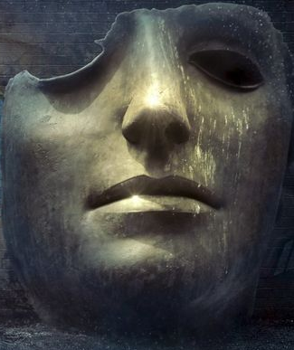

# სესია 1 — მკრეხელი

## გამოღვიძება

(სესია 0-ის მოვლენები კანონიკურია, მაგრამ ვაიკარი ბარდის ნაცვლად მოციქული გახდა
და შეეცვალა გარეგნობა. კიმჩიმ სახელი გზაში მოიფიქრა.)

თერბისასკენ გზა. სილვერმერის სახელმწიფო კარეტაში ისხდნენ წითელში გამოწყობილი
მიკრი, შავში ჩამალული ბონდრიუდი, უმკლავებო საღამურში გამოწყობილი კიმჩი, თეთრში
მოსილი მამუ და ჩაქინდრული, კანი სრულად ბინტით მოსილი, ყორანის ბუმბულისფერი
მოსასხამით დამშვენებული ვაიკარი. ღამე გალეულიყო და აისს შეეფერადებინა ცა.
მძღოლმა, რომელსაც მთელი გზა ჩუმად მიყავდა რაზმი, უკან მოიხედა და თქვა:

„ბოლოს და ბოლოს გამოიღვიძეთ. თითქმის მოვედით, ბიჭებო. ერთი საათიღა გვინდა და
მგონი ჯობია სადმე გაჩერდეთ, დაღლილი იქნებით, ნამგზავრები...“

გზაზე გადაერთო მძღოლი თუ არა, აბჯარში შემოსილი ბონდრიუდი ადგა და მისკენ ნაბიჯი
გადადგა. მამუ გამოუხედავად მიხვდა რაღაცას და გადაჯდა ყველაზე წინ. აბჯრის
ჩხრიალზე მძღოლმა წამით გამოიხედა და დაინახა მამუს თეთრი სათლისნაირი ჩაფხუტი.
გამოჩენილ პირ-ნიკაპზე ღიმილი დასთამაშებდა მეომარს. ტკბილი იყო იგი მძღოლისთვის,
ნაღველზე უფრო მწარე ბონდრიუდისთვის, რომელიც იმ წამსვე დაჯდა. ამას
დაგიმახსოვრებო, გაიფიქრა გულში.

ვაიკარმა ბინტისა და სიშავის კუბოდან წამით გამოიხედა. თვალი გადაავლო გარშემო
მჯდომთ და მზერა კუთხეში მჯდომ მომღიმარ კაცზე მიაპყრო. მიკრ ინალის დანახვა ისევე
გაუხარდა, როგორც მამუს საქციელებმა ნერვები მოუშალა. მოულოდნელად განუცხადა
ინტერესის ობიექტს:

„მიკრ, შენი ნამდვილი სახე მაჩვენე.“

„რა ნამდვილი სახე მე ისეთი ვარ როგორიც ვარ“ — მიუგო მიკრმა მეტისმეტად ბრტყელი და
მკვეთრი ტონით, რომელიც ბავშვურობის ძლიერ შთაბეჭდილებას ტოვებდა. გაკვირვებული,
ადგა და ვაიკარს მიუჯდა, მისი დაჟინებული თხოვნის შემდეგ. ბინტმოსილმა სერთუკის
უბიდან პატარა ფლაკონი ამოიღო და მომღიმარს გადასცა, რომელსაც ზედ ეწერა „№9-0531“.

კარეტაში მსხდომებმა ვაიკარის გაცნობის მომენტიდანავე იგრძნეს, რომ ამ უცნაური
გარეგნობის უკან რაღაც შემაძრწუნებელი იმალებოდა. ბოლო-ბოლო, სილვერმერში არ
დადიოდა კაცი, რომელსაც ასე ჰქონდა ამოვსებული ჯიბეები პატარა შუშის სინჯარებით.
სითხეც, რომელიც შიგნით ესხა, წააგავდა რაღაც ავი ძალით გაფუჭებულ სისხლს, თითქოს
ვიღაც ჯერ დაეწყევლოთ, მერე მოეკლათ. მაინც, მიკრს, როგორც ჩანდა, სრული ნდობა
გააჩნდა ამ საეჭვო კაცის მიმართ. მოყვითალო სითხით სავსე ფლაკონი იქვე გახსნა და
გადაიპირქვავა. ჩამოწია თუ არა ხელი, ვაიკარს შეხედა. გადიდებული ჰქონდა თვალები,
სუნთქვა — გახშირებული, ღიმილი — გაფართოებული. მადლობა შესწირა და თავის ადგილას
დაბრუნდა.

## მასპინძელი ქალაქის გაცნობა

ქალაქ თერბისას გალავანი მალევე გამოჩნდა. მზე უკვე ამოსულიყო, არემარეს ამშვენებდა
მოყვითალო ელფერი. რომ ყოფილიყო თერბისა მოვლილი, მზის ამოსვლა მას უფრო და უფრო
შემატებდა მშვენებას, მაგრამ იგი ასეთი არ გახლდათ. შორიდანვე მოჩანდა და
იგრძნობოდა ის სიბინძურე, რომელიც გალავანში შესვლისას მწარედ იგემეს
ახლადმისულებმა.

მძღოლმა ქალაქში შეყვანილი კარეტა შეაჩერა და კიდევ ერთხელ უკან გამოიხედა. ჩადითო
თქვა თუ არა, შავთეთრაბჯროსანი წყვილი წამოიჭრა და მასთან მივიდა. მძღოლს ყოველ
სიტყვაზე ორ კითხვას უბრუნებდნენ და ამით კარგად რომ შეარყიეს მისი კეთილსულოვნება,
ახალ ეტაპზე გადავიდნენ.

„დაიგინე!“ — განუცხადა ბონდრიუდმა.

„ვ... ვინც მოიტყუოს, იმისი დედა ვატირე!“

„ვენდოთ ამ კაცს!“ — ამაყად წამოიძახა.

ჯგუფური სიტყვიერი ცემა-ტყეპით გული ბოლომდე ვერ იჯერა წყვილმა. მძღოლი უფრო
დამყოლი აღმოჩნდა, ვიდრე მოელოდნენ და მათ მიმართ უკვე დიდი წყენის მიუხედავად, არ
შედიოდა პოლემიკაში. ჩიხში რომ შევიდა ერთი გართობა, მოვიდა მეორე. 

„გამარჯობათ!“ — განაცხადა მოშორებით მდგომმა შუა ასაკის მელოტმა კაცმა, რომელსაც
კარგად გაწვრთნილი მეომრისთვის დამახასიათებელი მკაცრი გამოხედვა გამოჩენოდა
სახეზე. მამუმ თავის წარდგენის საშუალება არ მისცა. მკვირცხლად დაფარა მასსა და
წინამძღოლს შორის მანძილი და ჰკითხა:

„ენრიკო ხარ?“

„ჯერ ერთი, მამა ენრიკო. მეორეც, არა, მამა ენრიკო თქვენ ტაძარში გელოდებათ. ჩემი
სახელია ჯარჯი, თქვენი ზედამხედველობა მავალია.“ — მიუგო მოზომილად.

„მამუ, ნახე აბა აწევ თუ არა ამ კაცს“ — თქვა ბონდრიუდმა და მეორე მხრიდან დაუდგა
ჯარჯის. მამუმ იგი იმწამსვე ხელებში აიყვანა, ბონდრიუდმა კი ხელები აიკაპიწა და
ჯიბიდან პატარა ქისა ამოაცალა. ყურადღების გადატანა ერთი მომენტით კი უნდოდა
შავაბჯრიანს, მაგრამ ნომერი კიდევ რამდენიმე წუთი გაგრძელდა. საბოლოოდ ჩამოსვა თუ
არა მასპინძელი თეთრაბჯრიანმა, მან გესლიანად დასძინა:

„სამწუხაროა, მაგრამ ყველაფერი უზრუნველყოფილია. ორმაგს გადაგახდევინებდით, რომ
შემეძლოს.“

ამაზე ბონდრიუდმა შეყვირა:

„რას ჰქვია ორმაგს გადაგვახდევინებდი?! შენ თავი ვინ გგონია?! მასპინძელი ხარ და
უნდა მოგვემსახურო ისე, როგორც ვიმსახურებთ!“

ამაზე ჯარჯის პასუხი აღარ გაუცია. ტანსაცმელი გაისწორა და თავის გზას დაადგა.

## ერთი ოქროს ძალა

ქალაქში შემოსვლის მომენტიდან ყველას ნესტოებში რაღაც საშინელი სუნი უტრიალებდა.
ჭუჭყითა და ტალახით მოსვრილი ქალაქისგან ბევრს არაფერს ელოდნენ, მაგრამ სიმყრალე
იმდენად ძლიერი იყო, რომ ტვინი წყაროს უმალვე გაგებას ითხოვდა, რათა რაც შეიძლებოდა
მალე განშორებულიყო. ბევრი ძებნა არ მოუწია ვაიკარს. ჯარჯის სცენიდან გასვლის მერე
თვალებმა მისმა იხილეს გვამი და თან არა ერთი. ქუჩაში მიყრილიყვნენ საცოდავად,
არავის არც გაჰყავდათ ისინი, არც მარხავდნენ. ორწუთიანი გამოკვლევის შედეგად ცხადი
გახდა, რომ მოხუცებული ქალი, რომელთანაც მივიდა, შიმშილით გარდაცვლილიყო. სხვებსაც
იგივე ნირი ჰქონდათ, მაგრამ მათი კარგად დანახვა ოდნავ გართულებულიყო —
შავთეთრაბჯროსნები ჩხრეკდნენ. დაინახა რა ეს, მოციქულმა არჩია, ხელი არ დაეკარებინა
ქალის გვამისთვის. 

ორი წუთი გავიდა. როგორც მოელოდა, წყვილმა ვერაფერი ამოიღო, გარდა სიბინძურისა.
თავის თავს ერთი წამით დაუსვა კითხვა, ღირდა თუ არა აქედან ნიმუშის შეგროვება.
ორჭოფობდა, მაგრამ მაინც გადაწყვიტა გვერდით მდებარე ახალგაზრდასგან აეღო
საჩვენებელი თითი.

ამასობაში კიმჩი მოშორებით წავიდა, ამოიღო თავისი ლირა და ძირს დადო. დაიხარა,
უსიტყვოდ მოაგლიჯა ერთი ღერი გრძელი თმა გვამს და ინსტრუმენტზე ზედ დაახვია. არც
ჩამოუკრავს, ისე დაბრუნდა ყველასთან.

მას შემდეგ, რაც ახალმოსულები მკვდრების ინსპექტირებას მორჩნენ, გეზი ტავერნისკენ
აიღეს. როგორც ყველა სხვა სახლი, ისიც ჩახლამული და ბნელი იყო, მაგრამ პატრონის
ხელი მაინც ეტყობოდა. შევიდა თუ არა ჯგუფი, იქვე მჯდომმა კაცმა ზიზღნარევი მზერა
ესროლა ყველას, გადააფურთხა და რაღაც ჩაილაპარაკა. ბონდრიუდი, მისი საქციელით
აღშფოთებული, მივარდა მასთან.

„რას იფურთხები აქ შენ?“

„თქვენნაირი გარეწრები რომ ჩამოათრიეს, მაგას“ — მიუგო კაცმა და კიდევ ერთხელ
დადორბლა იატაკი. ბონდრიუდმა საპასუხოდ მუშტი მოუქნია, მამუ კი გვერდზე ამოუდგა.
მწარედ მოარტყა შავაბჯროსანმა შუბლში და სადაც იყო კარგად დაბეგვავდა, მაგრამ
კუთხიდან ვიღაც გამოვარდა გასაშველებლად. ჩადგა თუ არა მათ შორის ჯარჯი, იქვე მდგომ
მიკრს წამით შეუმცირდა ღიმილი. მოსალოდნელი უნდა ყოფილიყო ზედამხედველის კიდევ
ერთხელ გამოჩენა, თან ისეთ შარიან ადგილას, როგორიც ტავერნა იყო, მაგრამ მაინც
წამით სახტად დარჩა მზირი. ლაპარაკი რომ დაიწყეს, ცხადი გახდა, რომ ბონდრიუდი
ტყუილად შარს არ ეძებდა და მართლა შეურაცხყოფილად გრძნობდა თავს. ჯარჯი ამშვიდებდა,
მე ამას მივხედავ, შენ აღარ გინდაო. „მიხედავ?“ — მოულოდნელი სიმშვიდით კითხა
ბონდრიუდმა და ხელი გაუშვირა. ჯარჯის სახეზე მრავალი გრძნობა უთამაშებდა. თან
მზრუნველობა და თან ზიზღი, თან პატივისცემა და თან უარესის მოლოდინი. გრძელი პაუზის
მერე ორჭოფულად ჩამოართვა ხელი შავაბჯრიანს.

სტუმრები მაგიდის გარშემო შემოსხდნენ. მოვიდა მიმტანი ქალი, რომლის სილამაზეც თვალს
ჭრიდა. ვერ გაეგო მიკრს ეს იმის გამო იყო, რომ სიბინძურეს იყო თვალი მიჩვეული, თუ
პელორმა უბოძა ათინათი, როგორც ამბობდნენ ხოლმე. გამოელაპარაკა თავისი უცნაური
ხმით. კითხა, რა გაქვთო. ქალი ისედაც დაძაბულიყო, ამ კითხვამ კი განსაკუთრებით
ააღელვა. არჩევანი მწირე იყო, მაგრამ ყველამ რაღაც მაინც შეუკვეთა.

შეკვეთის ბოლოს მიკრმა კითხა ქალს, რამდენი უნდა გადაეხადათ.

„ორი სპილენძი.“ — უპასუხა.

„აი ინებეთ ხურდა თქვენთვის დაიტოვეთ“ — ღიმილით თქვა და ერთი ოქროს მონეტა
გადასცა. ქალმა გაოცება წამით ვერ დამალა.

რამდენიმე საათის წინ მიღებულმა ხსნარმა მიკრის ღიმილს ღონე შესძინა და იგი
კიაფობდა მის სახეზე, როგორც ჩრდილოეთის ვარსკვლავი. მამუს ეს ეგზომ აღიზიანებდა.
თეთრაბჯროსანმა სათლ-ჩაფხუტიდან ამრეზილად ჩახედა წითელში გამოწყობილს, რომელსაც
დიდი ამბით ტყავის აბჯარი მოეცვა ზევიდან. მაინც, თავისი იმიჯისათვის წინ გადადგა
ნაბიჯი და უმნიშვნელო ბაასი გააბა. ისე მოეჩვენებოდა გამვლელს, რომ რაც წინ მიდიოდა
საუბარი, მით მეტად ჩლუნგდებოდა მიკრი და მით უფრო დასცინოდა მამუ. კაცისგან,
რომელსაც იმხელა აბჯარი ეცვა, რომ ორი, თუნდაც სამი კაცის ადგილს იკავებდა
სიგანეში, დაწვრილებული ხმა მოისმოდა. თან გამაქილიკებელი, თან, შეიძლება ითქვას,
საყვარელი.

ბონდრიუდი გარეთ გავიდა და თავისი მოპოვებული პატარა ქისა ძირს დააგდო. ხმალი
იშიშვლა, შორს დადგა და დიადი სიფრთხილით მახვილის წვერით გაუხსნა პირი. ორი
მოწითალო მომრგვალო პატარა ნივთი გადმოიყარა. ნელ-ნელა მიუახლოვდა შავაბჯროსანი.
დარწმუნდა, რომ საშიში არაფერი იყო და უცნობი ნივთებიც იმდენად რბილი იყვნენ, რომ
ბასრ პირს ატარებდნენ. ახლოდან დააკვირდა თუ არა, მიხვდა, რომ თურმე სათესლე
ჯირკვლები ჩაეგდო ხელთ.

ნადიმის ბოლოს ბონდრიუდი ვაიკართან მივიდა. იცოდა, რომ ბინტმოსილისთვის ქისა
გამოსადეგი იქნებოდა და გაცვლა შესთავაზა. მიიღო თუ არა ძღვენი, ვაიკარმა თქვა:

„რაღაც დაგივარდა, ჯობია აიღო.“

ბონდრიუდმა იატაკიდან პატარა, წითელი სითხით სავსე ფლაკონი აიღო, რომელსაც ეწერა
„№13-333“.

„ეს არის ნაღვერდალმქმნელი. დღეს სანამ დაიძინებ, გასინჯე. მენდე.“

ღიმილით უნდოდა ვაიკარს ამის თქმა, მაგრამ მისმა სახემ ბონდრიუდისთვის ცოტა არ იყო
საშიში ფორმა მიიღო. განსაკუთრებით ბოლო სიტყვა ეხამუშა. მენდეო. ასე ისეთი ხალხი
ლაპარაკობდა, ვინც არ იყო არასდროს სანდო.

შემოპასუხების მერე ბონდრიუდმა გადაწყვიტა, რომ თავი დაენებებინა ამ ხსნარისთვის და
თავისკენ გაწია.

## საერთო გასაჭირი

სტუმრები სამ ოთახში გადანაწილდნენ. მამუ და ბონდრიუდი ერთგან, მიკრი და ვაიკარი
მეორეგან, კიმჩი — მესამეგან. ეს უკანასკნელი თავისთან შელაგდა თუ არა, ეგრევე
დერეფანში გამოვიდა და ერთ-ერთ კარს მიადგა. დააკაკუნა. კარი ვაიკარმა ნელა გააღო.

„შენი საიდუმლო ვიცი“ — მოკლედ მოუჭრა ბერმა.

„ერთ საიდუმლოს გეტყვი. გაა🤬ვი“ — მიუგო ვაიკარმა.

სანამ კარი ბოლომდე დაიხურებოდა, კიმჩიმ შეამჩნია რაღაც უცნაური: კუთხეში მდგარ
საწოლზე მიკრი თვალებგახელილი იწვა და იღიმოდა. წამით მოასწრო მარტო დანახვა,
მაგრამ მზირს მაინც მოძრაობის არაფერი ეტყობოდა. გაშეშებულივით იყო. დახურული კარი
თავიდან გააღო კიმჩიმ, ოთახში შევარდა და თავზე დაადგა მიკრს. რა გინდა, წადი
აქედანო, შეუღრიალა ვაიკარმა. მართლაც რომ გაქვავებულივით იყო წითლებში ჩაცმული
კაცი, ხელებიც გულზე ედო, თითქოს ლოგინი კუბოდ ქონოდა ქცეული. მიხვდა რა, რომ
ვაიკარის ნერვებზე თამაშობდა უკვე, ზურგზე მოფარებული პლედი მოიხსნა და მიკრს
გადააფარა, რის მერეც უსიტყვოდ დატოვა ოთახი.

მოშორებით, სხვა ოთახის კართან, ვიღაც შიკრიკი მისულიყო და აკაკუნებდა. ბონდრიუდმა
გაუღო და წერილი გამოართვა. ოთახში შევიდა, დაჯდა, გასხნა, გადაიკითხა და
უმალვე ცეცხლი წაუკიდა. აალებული ქაღალდი ხელიდან სტაცა მამუმ და თვითონაც
გადაავლო თვალი, შემდეგ ისევ მიუშვირა სანთელს.

ძილ-ბურანში ჩავარდნილიყვნენ შავთეთრაბჯროსნები. კარეტის ყანყალით გატეხილ ძილს
დაბრუნება ეწადა, მაგრამ შუადღისას ქალაქის სიბინძურენი ხმაურობდნენ. ისმოდნენ
ხმები ყვირილისა. ბონდრიუდს ყურთ მოხვდა თუ არა შორიდან მომავალი ქალის განწირული
კივილი, სრულად გამოფხიზლდა. მსწრაფლ ადგა, აბჯარი გადაიცვა და, მკერდგაშვერილი და
წელში გამართული, ოთახის გარეთ გავიდა. მას უკან მოყვა მამუ. ორივე სწრაფი ნაბიჯით
გავიდა სასტუმროდან და მივიდა ერთ-ერთ ჩიხში. ღრმად შევიდნენ თუ არა, დაინახეს
რაღაც ეგზომ უწმაწური: ორ კაცს ხელში ჩაგდებული ჰყავდა ვიღაც ქალი და ეძალებოდნენ.
ბონდრიუდმა მსწრაფლ ამოიღო ქარქაშიდან ხმალი და ყველაზე ახლოს მდგომისკენ გაიქცა.
მისდა მოულოდნელად, ჩრდილიდან წამით გამონათებულმა ხმლის პირმა დამნაშავე შუაში
გააპო. გავარდა იგი მეორესთან, ძირს დასცა და ყელი გამოღადრა.

უჩინმაჩინივით მიმალული მესამე პირი სინათლეზე გამოვიდა. ბონდრიუდმა დაინახა თუ არა
მისი სახე, მივარდა და გადაეხვია, როგორც ძმასა და მეგობარს. უცნობიც ჩაეხუტა
გულიანად და ხელი ზურგზე გადახვია. ერთმანეთი მოიკითხეს თუ არა, გასწიეს მამუსკენ,
რომელსაც ქალისგან ყელსაბამი აეწაპნა. ბონდრიუდმა თავისი მეგობარი გააცნო, როგორც
დარიუსი — მონათა ბაზარზე გაცნობილი კეთილი სული.

ახალშეკრებილები ბონდრიუდის ინიციატივით ვაიკარის ოთახს მიადგნენ. კაკუნის
საპასუხოდ კარი ნელა გაიღო და სამეულმა დაინახა, როგორ ჩაქინდრულიყო ვაიკარი წინ
გამოდგმულ სკამზე. ყველამ იცოდა, რომ ელფის „ძილი“ ძალზე განსხვავებული რაღაც იყო,
მაგრამ ვაიკარის მრუმე მზერა მოულოდნელად შემაძრწუნებელი აღმოჩნდა. „რა გინდა“ —
ნელა თქვა და უფრო ნელა აიწია ზევით. ბონდრიუდმა ეს არ შეიმჩნია და დარიუსი გააცნო.

„მიკრს თქვენთვის არ სცალია.“ — ცივად მიუგო ვაიკარმა.

„შენ რა, მაგისი მეურვე ხარ?“ — ნამდვილი ინტერესით ჰკითხა მამუმ. პასუხი რომ არ
მიიღო, დაამატა: „მართლა ეგრე იქნება“.

დარიუსმა განუცხადა ყველას, რომ რაზმში მატება იყო მოსალოდნელი. მის გარდა, კიდევ
ერთი კაცი იყო მოსასვლელი.

სრულიად მოულოდნელად, მიკრმა თვალები დაჭყიტა. არაბუნებრივად სწრაფად წამოჯდა,
საბანი გადაიხადა და ჩაუცმელად ადგა. ახალმოსულთან მივიდა და დაჟინებით გაეცნო,
კვლავ თავისი ეგზომ ბავშვური ლაპარაკის მანერით. დარიუსი თავიდან ცდილობდა არ
შეემჩნია, მაგრამ მიკრის ენერგიამ იმდენად გააღიზიანა, რომ ზიზღი საბოლოოდ ვერ
შეიკავა. მზირს ეს დიდად არ ადარდებდა.

ნივთებს რომ ალაგებდა დარიუსი, ავტოპორტრეტი ამოიღო. ქაღალდის ნაჭერზე ფანქრით
გამოსახული მას ნამდვილად ჰგავდა: მოსასხამივით გრძელზე გრძელი პალტო ტყავის
ჩექმებამდე წვდებოდა, მოგრძო თმა გვერდით მომზირალ სახეს ალამაზებდა, ზურგს კი დიდი
ორხელიანი მახვილი უმშვენებდა. ბევრი ილაპარაკეს ამ სურათზე. საბოლოოდ ვაიკარმა
ყველა ოთახიდან გაყარა.

რომ გავიდნენ სტუმრები, ოთახის მეპატრონე, დარწმუნებული, რომ მარტო დარჩა მიკრთან,
თავიდან მოთავსდა სკამზე. უკან გადაწვა. ხელი, რომელიც ჩამოშვებული ჰქონდა, ზევით
აღაპყრო და პერანგის ჯიბიდან შუშის სინჯარა ამოასრიალა. ალისფერი სითხე ესხა
შიგნით. მოხსნა საცობი თუ არა, წამში გადაკრა, თითქოს ნოქსუსურ რიტუალს ატარებდესო.
როგორც კარეტაში მიკრს, მასაც ამ ნივთიერებამ რაღაც დიდი ბიძგი მისცა.
ბნელი მელანქოლია უცნობმა სინათლემ გაფანტა თითქოს. ამოიოხრა თუ არა მეორედ
ვაიკარმა, გვერდიდან მოესმა ძალით დაწვრილებული კაცის ხმა:

„აუ რა არის ბიჭო ეს? რა სითხეა? შენზე სწრაფად თუ არ დავლიო, ქინძი ვარ...“

უზარმაზარი აბჯარმოსილი მამუ არსაიდან გამოჩნდა. უფრო სწორად, შემალულიყო სადღაც,
ვაიკარის თვალსაწიერის იქით და სითხეს გამოეტყუებინა სამალავიდან. აიღეო, გადასცა
ვაიკარმა. სინჯარას „№8-746“ ეწერა. უყურებდა თავისი ყვითელი თვალებით ალისფერ
სითხეს, მაგრამ რაღაც შინაგანი ძალა თითქოს არ აძლევდა საშუალებას, რომ შეესვა.
ვაიკარმა დავიბრუნებ მაშინო თქვა, მაგრამ მამუმ მაინც წაიღო სითხე თავისთან.

გარეთ ბონდრიუდსა და დარიუსს ბაასი გაებათ:

„სადამდე მოვედით... ერთ დროს დიდებული ხალხი, ახლა...“ — ოხრავდა დარიუსი.

„რა დიდებული? მონათა ბაზარზე გაგიცანი“ — უპასუხა ბონდრიუდმა.

„მარტო მონები კი არ არიან იქ. ქალი რომ ვნახე ქუჩაში, ის გამახსენდა და თავი ვეღარ
შევიკავე...“ 

„რა გაგახსენდა?“ — ცნობისმოყვარედ ჩაეჩრა საუბარში მამუ.

„მაგას ვერ მოგიყვებით“ — მიუგო ბონდრიუდმა — „ჩვენ ისეთი რაღაცები გვაქვს
გამოვლილი, რომლის გახსენება არ ჯობს.“

„ერთს გეტყვით“ — დაამატა — „არ უნდა ენდოთ ამათ, ამ ვაიკარსა და მიკრს. ისინი მე
ვერ მცნობენ, მაგრამ მე ორივეს ვიცნობ. შავბნელ საქმეებში არიან გარეული. თუ რამე
გვინდა გამოგვივიდეს, ერთად უნდა ვიყოთ და არა ამათთან შეთანხმებაში.“

სიჩუმე ჩამოწვა წამით. იმავე ბონდრიუდისგან, რომელიც სულ რაღაც რამდენიმე საათის
წინ მთელ თერბისას ეჩხუბებოდა, ასეთი ნათქვამი მოულოდნელი იყო. მით უმეტეს ის
გაფრთხილება, რომელიც თავის სიტყვებს მოაყოლა:

„ვიცი, რომ ჩემგან ეს ცუდი მოსასმენია, მაგრამ თავი უნდა მოთოკო, დარიუს. აქ
ყველასა და ყველაფერზე გაბრაზება არაფრითაა კარგი“.

და მაინც, მამუს მოაგონდა კითხვა ახალი:

„დარიუს, რატომ არ გქვია მარიუსი?“

„რავი, მამაჩემს კითხე...“

„მამაშენთან შემახვედრე და ვკითხავ“ — წვრილი ხმით მიუგო მამუმ.

ასე გაგრძელდა დიდი ხანი. მამუს სარკაზმზე წამოგებული დარიუსი მამასთან გაცნობის
გეგმებს ალაგებდა, ხოლო თეთრაბჯროსანი ისე დახტოდა თავის სიტყვებზე, თითქოს მიდით
მთვრალი კურდღელი ყოფილიყო.

## მამას დავალება

შემდეგი დილა რომ გათენდა, ტავერნას დიდი მაგიდის გარშემო ისევ შემოსხდნენ
სილვერმერელი გაწვეულები. საამური სუნი ტრიალებდა. მიმტანს აღარ ეტყობოდა დარდი და
ვარამი. თითოს ორ-ორი შემწვარი კვერცხი და თითო ნაჭერი პური დაურიგა. ვაიკარმა
სინჯარა ამოიღო და რაღაც ბლანტი წითელი სითხე დაასხა მისაყოლებლად.

დარბაზში ჯარჯი გამოჩნდა.

„დილა არამშვიდობის. იმედია უგემური იყო კვერცხი.“

„რას ქვია? მშვიდობას არ გვისურვებ?“ — გამოეხმაურა ბონდრიუდი, ადგა და წინ დაუდგა.
გვერდისგვერდ მამუ და დარიუსი მიუდგნენ. ბონდრიუდის ნიშანზე, სამივემ ხელი წაავლო
ჯარჯის და ჰაერში აიტაცა.

ცოტა ხანი წათამაშების მერე ძირს დასვეს.

„იცოდე, ეგრე იზამ კიდევ, ხელი აღარ გექნება“ — მიუბრუნდა ბონდრიუდს. ახალი დღის
ენერგიით აღსავსე შავაბჯროსანი კი უფრო და უფრო იწვევდა გამცილებელს. ერთხელ, ორჯერ
და მეტჯერაც უთავაზა სახეში გაშლილი ხელი, მაგრამ ჯარჯი მაინც იდგა. განა მედგრად.
წყენით ივსებოდა ნელ-ნელა, მაგრამ არ მოქმედებდა. საბოლოოდ ენრიკო მზად არისო
წაიბურტყუნა და გავიდა.

თერბისას პელორის სახელობის ტაძარი ყველა მორწმუნესთვის ცნობილი იყო, როგორც
სილვერმერის ერთ-ერთი საოცრება. ხუთი საუკუნის წინ აღმართული ნაგებობა სიმყარეს
მედგრად ინარჩუნებდა და ამას ყველა ეგრეთ წოდებულ აღმშენებლურ სტილს უმადლიდა.
მზისა და სინათლის ღვთაების სისპეტაკისთვის შენაწირი, როგორც ქარაგმულად
მოიხსენიებდნენ ხოლმე, თერბისაში კი იდგა, მაგრამ შენობას ქალაქისგან სულიერი
სიშორე ახასიათებდა, ოღონდ ცუდი გაგებით. გალავნის ის მხარე, სადაც იგი
ბრძანდებოდა, იყო არა მხოლოდ სუფთა, არამედ აღმაფრთოვანებლად მოწესრიგებული.
ბავშვები აქეთ-იქით ფუსფუსით მიმოდიოდნენ, სიცოცხლე ჩქეფდა შენობებში და მათ გარეთ.
მეორე მხარე კი არა მარტო ღვთის, არამედ კაცის მიტოვებულიც კი იყო თითქოს.

ეკლესიაში შესვლისას დარიუსი გვერდზე გადგა და თქვა გარეთ დაგელოდებითო. დანარჩენი
ყველა შევიდა. ცენტრში მაღალი, გამხდარი და ფერმკრთალი მამაკაცი იდგა, რომელსაც
იასამნისფერი მანტია ჰქონდა მოცმული. შემოსულთა დანახვაზე იგი შემოტრიალდა და
ომახიანად უთხრა:

„მობრძანდით, შვილო!“

ყველა ერთიანად დაიძრა მამუს გარდა, რომელიც წინ გაიჭრა. ცალ ხელში რაღაც ეჭირა.

„ენრიკო ხარ, ხო?“

„მამა ენრიკო, შვილო. დიახ, მე ვარ.“

„ეს ჩემი ძღვენი შენ“ — თქვა და თითების გაქნევით ხელში დაჭერილი ქაღალდი ჰაერში
ისროლა. დიდი სიჩქარით გასროლილი ქაღალდი უცბად შენელდა და ფარფატით ჩამოვარდა
ძირს.

მამა ენრიკო იმავე სახის გამომეტყველებით უყურებდა მასთან ატუზულ მამუს.

„მაშ, თქვენი ძღვენი?“

„ესაა“ — თითი გაიშვირა ძირს დავარდნილ დაკეცილ ქაღალდზე.

თავიდან შეხედა მამა ენრიკომ თეთრაბჯრიანს, მაგრამ აღარაფერი უთქვამს მისთვის.
გამოიწია გვერდით, გადახედა სხვებს და თქვა:

„მე დღეს აქ დაგიბარეთ მისიისათვის. შემოიყვანეთ!“

დამხმარე ბიჭებმა დარბაზში შემოათრიეს კაცი. გაკოჭილი იყო იგი და თან აშკარად
ნაწამები. ძონძები ეცვა ტანზე და სახეზე ბევრი იარა ეტყობოდა.

„ეს კაცი მკრეხელია. რამდენიმე დღის წინ ჩემი მოკვლა სცადა, რისთვისაც ღმერთმა
დასაჯა.“

„ეს ღმერთმა გააკეთა თუ შენ?“ — ჩაეჩრა მამუ.

„რანაირი კითხვაა ეს, შვილო? ჩვენ ვართ ღვთის ხელი, ჩვენ ვასრულებთ მის ნებასა და
ბრძანებას“ — უპასუხა.

„ნოქსუსელია,“ — გააგრძელა — „როგორც იცით, ნოქსუსის საზღვარი ჩაკეტილია და დიდი
კედელი გვაქვს აღმართული. რანაირად მოხვდა აქეთ, მეც არ ვიცი“.

„ანუ უცნაური ტელეპორტი გააკეთა?“ — კვლავ დაუკითხავად იკითხა მამუმ.

მამა ენრიკომ წამით შეხედა მამუს თვალებში. თეთრაბჯროსანმა კითხვა გაიმეორა.

„როგორც ჩანს. ამ ურჯულომ და უჯიშომ მიამბო ამათი ამბავი. ბანაკი საზღვარზე ჰქონიათ
გაშლილი და მიხვალთ?“

„რათქმაუნდა!“ — თქვა ხმამაღლა მიკრმა.

„არჩევანი არც გაქვთ“ — დასძინა ენრიკომ. მიკრის ენთუზიაზმი არც შეუმჩნევია.

„ენრიკო, რა იცი უცნაური ტელეპორტის შესახებ?“ — კითხა მამუმ მრავალჯერ.
პარალელურად სხვებმაც ლაპარაკი დაიწყეს და მოზომილი საუბარი ნელ-ნელა ყაყანად იქცა.

„სიჩუმე!“ — შეყვირა მამა ენრიკომ — „ვინ ხართ თქვენ ასეთი უჯიშოები?“

მზერა მამუსკენ მიაპყრო და გაბრაზებულმა კიდევ ერთხელ უთხრა, რომ მამა ენრიკოთი
მიემართა მისთვის. ურჩობა ეტყობოდა თეთრში მოსილ რაინდს თვალებში, პირზეც ღიმილი
უთამაშებდა. ამის დამნახველმა მამა ენრიკომ რაღაც ჩაიბუტბუტა და თვითონაც ჩაიღიმა.
მისდა სამწუხაროდ, მამუს ნირი არ შეცვლია.

სადაც იყო, უკან გაბრუნდებოდა ამალა, რომ მამა ენრიკომ მიაძახათ:

„ა, სულ დამავიწყდა. შვილო, შემოდი.“

იმავე კარიდან, საიდანაც პატიმარი გამოათრიეს, გამოვიდა უცნაური გარეგნობის ბიჭი.
ტანით პატარა იყო, 12-13 წლის ეგონებოდა შემხედვარეს. ლაბადა ემოსა, რომელიც
მთლიანად ვარსკვლავებით იყო გადახუნძლული. ტანზე ეცვა საღამურივით თავისუფალი და
ფუმფულა ზედა, რომელსაც აგრეთვე ვარსკვლავური ორნამენტები შვენიდა. ნაცრისფერ
ქამარზე ვერცხლისფრად კიაფობდა შესაკრავი, რომელზეც ეწერა "HOPE". ქერა მოგრძო
თმაზე გვირგვინი ემოსა, რომელიც წინ წამოწეულიყო. ამ წამოწეულზე მიმაგრებულიყო
ნაჭერი, რომელიც სახეზე ჩამოფარებულიყო. ისეთი შთაბეჭდილება იქმნებოდა, თითქოს ის
ნაჭერი რაღაც სივრცესთან იყო დაკავშირებული და, რომ გეცადა, ხელს შიგნით შეყოფდი
კიდევაც.

გააცნო თუ არა მამა ენრიკომ მეგზური სტუმრებს, მამუ მოულოდნელად შეეჯახა მას.

„აღარ მინდა რა! გარეთ მინდა, თამაში მინდა! 500 წლის ვარ უკვე!“ — ამოიწუწუნა ბავშვმა.

„არა, შვილო, გაყევი ამათ“ — მშვიდად მიუგო მამა ენრიკომ.

საბოლოოდ ყველა გავიდა ეკლესიიდან. დიდი ხანი არ უვლიათ, რომ ბონდრიუდს რაღაც აზრი
მოუვიდა. კარგად რომ ახედ-ჩახედა ბავშვს, შეზიზღდა მისი გარეგნობა. მიხვდა, რომ
მისგან კაცი არ დადგებოდა და მოუნდა, რომ გამოსწორება და კარგ გზაზე დაყენება
ეთავა. ეკლესიიდან ორი წუთის სავალზე მამუს შეაბოჭინა ბავშვი და მასთან ახლოს
მივიდა. ბავშვმა ჯერ წუწუნი და მერე ღნავილი მორთო, მამუს უზარმაზარ ხელებს შორის
ფართხალებდა და თავისუფლებისკენ იწევდა. ბონდრიუდმა ხმალი მოიმარჯვა. გვერდზე გაწია
ვადა და მახვილის ბასრი პირი ბავშვის შუბლს დაუმიზნა. შეიცნო თუ არა სწორი მომენტი,
იარაღი იმწამსვე წინ გაწია, მაგრამ მახვილი რატომღაც შუბლის მაგივრად უცნაურ ნიღაბს
მოხვდა. იმის მაგივრად, რომ შეხებოდა, ჯერ შიგნით შევიდა და შემდეგ იქ გაუჩინარდა.
აღშფოთებულმა მეორე ხმალი ამოიღო და ეცადა უკეთ დაემიზნებინა, მაგრამ შედეგი იგივე
მიიღო. უცნაური სივრცის შემწოვმა ძალამ შავაბჯროსანი უიარაღოდ დატოვა.

ხელი გააშვებინა ბონდრიუდმა მამუს და ბავშვი ძირს დავარდა. ღნავილი ტირილში
გადაიზარდა, თანაც საკმაოდ წუწუნა ხასიათისაში. მიკრი და სხვები გაფაციცებით
უყურებდნენ მამუსა და ბონდრიუდს, მაგრამ რამის სამოქმედოდ უკვე გვიანი იყო — მამა
ენრიკო მოსულიყო მრისხანე სახით. ამალას კიდევ ერთხელ მოუხდა მისი დარიგებებისა და
შეგონებების მოსმენა, ოღონდ ამჯერად მას აკომპანიმენტს ბონდრიუდი უწევდა. რას ჰგავს
ეს, კაცად უნდა დავაყენოო, მჭახედ შეახალა მამა ენრიკოს. პასუხად საყვედური და
მუქარა მიიღო.

ყველანი კარეტით მირას ტბისკენ გაემართნენ.

## გზაში შემოპატიჟება

გზაში სამი დღე გავიდა. ოთხი ნოემბრის შუადღე იყო, რომ კარეტა გზის გასაყარს
მიადგა. დიდი ნიშანი იდგა, თითქმის ისეთივე, როგორიც ყველგან სხვაგან. ერთადერთი
განსხვავება იყო რაღაც უცნაური წარწერა:

„აუცილებლად შემოდით“.

ყველამ ერთხმად და უსიტყვოდ გადაწყვიტა, რომ გადაეხვიათ და ენახათ, რაში იყო საქმე.
დიდი ხანი არ უვლიათ, რომ გზაზე უზარმაზარი სახლი გამოჩნდა. არა ჩვეულებრივი სახლი,
არამედ მდიდრული მანსიონი — ისეთი, როგორიც ალბათ მამა ენრიკოს ექნებოდა, სასულიერო
პირი რომ არ ყოფილიყო. შთამბეჭდავი კი იყო, მაგრამ აშკარად მიტოვებულიც.

ბევრი არ უფიქრია არავის და ჭიშკარზე დააკაკუნეს. პასუხად იგი თავისით გაიღო.

ყველამ ერთმანეთს ერთი წამით შეხედა. უცნაური სახლი თითქოს თავისით ეპატიჟებოდათ,
მაგრამ შესასვლელად რაღაც სახის თანხმობას ეძებდნენ მაინც. დარიუსმა ითავა ეს
საქმე. ზურგზე გადაკიდებული დიდი ხმალი მოიხსნა, ბონდრიუდთან მივიდა და გადასცა.

„სულ ჩემი გადასარჩენი როგორ ხარ“ — დააყოლა ზედ. შემდეგ მოტრიალდა ყველასთან და
უთხრა, რომ მოხეტიალე მუსიკოსების როლი უნდა აეღოთ, რაზეც მიკრს გაეცინა. პასუხი
არავინ დაუბრუნა და დარიუსმაც მიიჩნია, რომ დაეთანხმნენ.

ყველა წინ დაიძრა. კოსმო მოწყდა ადგილიდან და სახლში შევარდა. ვაიკარმა მიკრსა და
მამუს ხელი დაადო, ლოცვა წაიკითხა და უთხრა:

„ამიერიდან ვერა შეგაშინებთ რა მრუმე და შავი.“

შესასვლელი კარის იქით მინგრეულ-მონგრეული ავეჯით სავსე, დიდი ხნით მიტოვებული
ოთახი გადაიშალა. წინ და უკან დაიარეს, მაგრამ ვერაფერი ნახეს საინტერესო.
სწრაფადვე ავიდნენ მეორე სართულზე. კიბე აიარეს თუ არა, დაინახეს უზარმაზარი
დარბაზი, რომელიც ზომით სამეფო სასახლეებში მყოფთ ჰგავდა. გაემართნენ თუ არა
სანახავად, რაღაც უჩინარს შეეჯახნენ. მიკრი დაფიქრდა და გამოკვლევა დაუწყო.

„ჩვენ წინ უჩინარი ავეჯი დგას“ — თქვა და აღარაფერი დაუმატებია.

სანამ ყველა გაერკვეოდა სიტუაციაში, არსაიდან უცნობი ნიღაბმოსილი ფიგურა გამოჩნდა.
„დასხედით“ — ბრძანა თუ არა, უჩინარმა ავეჯმა ფორმა შეისხა.

„მამუ კა, ვაიკარ ვინველონ, კიმჩი, დარიუს, ბონდრიუდ, კოსმო, მიკრ ილან.“ —
ჩამოთვალა ყველას სახელი. კითხვაზე, ვინ ხარ და საიდან გვიცნობო თქვა:

„ძალიან უცნაურია, მაგრამ ჩემი იდენტობა უნდა დავიცვა, ნიღბით უნდა ვიყო თქვენთან.
ასეთია დღევანდელი ცხოვრება.“

„ვიცი, რაც გაქვთ დავალებული,“ — დაამატა „ვიცი, მამა ენრიკოს რომ ეძახიან, ვითომ
მამა...“

„მამიკოა“ — შეაწყვეტინა კოსმომ.

„ვინ ხარ, შვილო?“

„მამიკოა ჩემი, 40 წელია მზრდიდა“ — მიუგო.

„ეს ბავშვი გაიყვანეთ რა.“

„მოკლედ, თქვენ ახლა რაზეც მიდიხართ არის სისულელე“ — დასკვნის სახით განაცხადა
უცნობმა. მამუმ კითხა, საიდან იცი ეგო, პასუხად კი „დამიჯერეთ“ მიიღო.

„თქვენ ხო მიდიხართ ვითომ ნოქსუსელების გასანადგურებლად, ხო?“

„მოიცადე“ — შეაწყვეტინა დარიუსმა - „რა გასანადგურებლად, ჩვენ ხო მოხეტიალე
მუსიკოსები ვართ“ — თქვა და უმარილოდ გაიღიმა.

პასუხი არავის გაუცია.

„მე ვიცი თქვენ ვინც ხართ. თვალყურს გადევნებდით, რაც ეს მისია დაიწყეთ“ — მიუგო
ნიღბიანმა.

„მე ჩვენი ქვეყნისთვის საუკეთესო მინდა. იმ გარეწრებივით კი არ ვარ, მთავრობაში რომ
სხედან.“

მამუ კარგად დააკვირდა ამ უცნობს. იცოდა, რომ რაღაც გრანდიოზულს მოაყოლებდა უკვე
დიდ ნათქვამს, მაგრამ უნდოდა მისი ხასიათი და დამოკიდებულება შეეფასებინა.
საბედნიეროდ, კარგის მეტი არაფერი უგრძვნია. განაცხადა:

„შეგიძლიათ ენდოთ, ვგრძნობ, რომ კარგი ტიპია.“

ნიღბიანმა გააგრძელა:

„ჩვენი ორგანიზაციის ხალხმა თქვა, რომ ომის გაჩაღებაზეა საუბარი... საქმე
სეროზულადაა, ასე რომ მინდა ჩემთან ერთად ითანამშრომლოთ.“

„რატომ უნდა გენდოთ“ — იკითხა მიკრმა.

„იმიტომ, რომ სიმართლეს ნახავთ.“

„არა ეს არ არის ნდობის საბაბი მე არ ვიცი შენ ვინ ხარ და შენ შეიძლება ტყუილს
ამბობდე ასე რომ რა მიზეზი მაქვს იმის რომ შენ დაგიჯერო და ის გავაკეთო რასაც
მიბრძანებ“ — უპასუხა უჩვეულო სერიოზულობით, მაგრამ იგივე ბავშვური ტონით.

„მე მართლა არ შემიძლია ახლა არაფერი გითხრათ. არჩევანი მაინც თქვენზეა. მიბრძანდით
საზღვართან და შეასრულეთ თქვენი დავალება. იქიდან კაპიტნის მოყვანა დაგავალეს, ხო?
აი მაგას რომ აიყვანთ და დაკითხავთ, გაირკვევა ყველაფერი.“

მიკრს აღარაფერი უპასუხია. საბოლოო ჯამში ყველა ხვდებოდა, რომ უცნობი კაცი ცუდს
არაფერს უქადდა და არც მისიის შესრულებაში შეუშლიდა ხელს.

მამუმ სახელი კითხა უცნობს და მანაც მიუგო — ამონი.

## მირას ტბაზე შეტევა

გზაში გავიდა კიდევ ერთი დღე. კარეტამ ყველა ჩამოსხა კლდის პირას. მირას ტბა ქვევით
მოჩანდა. სანაპიროზე გაშენებულიყო ბანაკი, სადაც სამი დიდი კარავი იდგა.

გადახედა თუ არა გზებსა და ბანაკის განლაგებას, მიკრმა გამოაცხადა:

„მისმინეთ ახლა ჩვენ შეგვიძლია ასე გაკეთება გავიყოთ ორად მარცხნივ წავა ვიღაცა და
ყურადღებას გადაიტანს და მარჯვნივ სხვები შეტევას დაიწყებენ.“

მამუმ ინიციატივა გამოიჩინა, მე წავალ მარცხნივო. კოსმს მოკიდა ხელი და ჩაღიმებულმა
თქვა, ეს ვითომ ჩემი ტყვე იქნებაო. ყველა ამაზე შეთანხმდა.

დაიძრა მამუ და თან წაათრია კოსმი. ბავშვი ხმაურობდა გზაში, წუწუნებდა და
მოთქვამდა. ბანაკთან ახლოს რომ მივიდნენ, სამი მაღალი ტიპი დახვდათ.
გამოილაპარაკეს, მამუმ გააცნო საკუთარი თავი, როგორც ამ ბავშვის პატრონი. შუა
ლაპარაკში კოსმი ზედ დაახტა ერთ-ერთს და ჭიდაობა დაუწყო.

ამასობაში დანარჩენები მარჯვენა მხრიდან მიადგნენ ბანაკს. სამი კაცი მიდიოდა,
მაგრამ მარჯვენა მხარეს მდგომი მალევე გამოეყო ჯგუფს და ბანაკისკენ წავიდა.
ბონდრიუდი გაყვა უკან, მიკრი და ვაიკარი კი მარცხენა ორთან მივიდნენ. მიკრმა
იშიშვლა თავისი დაშნა, უკან მიეპარა ცენტრში მდგომს და მოულოდნელი შეტევა
განახორციელა. კარგად დაჭრილის გვერდით მივარდა ვაიკარი, ჩაქუჩი მოიხსნა ზურგიდან
და შემალული მექანიზმი გააქტიურა. გავარვარებული შიგნეულობიდან ნაპერწკლები
გადმოიყარა. ჩაქუჩი დაგეშილ ცხოველს ჰგავდა, რომელსაც სადაც იყო, პატრონი გაუშვებდა
და დააგლეჯინებდა მტერს. ვაიკარმა ხელები ზევით აღაპყრო და შეცბუნებულ დარაჯს თავში
ჩაახეთქა ბლაგვი პირი. დარიუსმაც იმავე ოპონენტს ხმალი აგემა, ხოლო კიმჩის რატომღაც
გაუვარდა დარტყმა და ნაკაწრის მეტი ვერაფერი მოახერხა.

მარჯვნივ წასულმა გაიგო თუ არა, რომ უტევდნენ, სწრაფად შეცვალა მიმართულება.
ბრძოლის ველზე უცბად გამოვარდა ხუთი შემზარავსახიანი ნოქსუსის ავი ძაღლი.

მარცხენა ფრონტზე ერთ-ერთმა დარაჯმა მამუ ხელებში აიყვანა და გვერდზე გადადო.
იმდენად ეწყინა ეს თეთრაბჯროსანს, რომ ეგრევე წვდა მოწინააღმდეგეს თავში და „მამბოს
გესლის“ ჩატარება დაიწყო, მაგრამ ხმალი კინაღამ ხელიდან გაუვარდა. ამ შანსით მაინც
ისარგებლა და ხელის გაშვების მაგივრად უფრო მაგრად მოუჭირა.

კოსმმა გადაფარებული ნაჭრის სიღრმეში შეყო ხელები და ამოიღო დიდი ჯოხი, რომელსაც
ბოლოში ყვითელი ვარსკვლავი ჰქონდა მიმაგრებული. თვალწინ მდგომისკენ მიიშვირა და
*მაგიური სრევი* აგემა.

ხმაურზე სხვებიც აფაცურდნენ. ორმა ჯარისკაცმა, რომელსაც ტყიდან შეშა მიქონდა, უცბად
იცვალა მიმართულება და ბანაკის უკანა მხარეს გაიქცა. ბონდრიუდმა მეომარს, რომელმაც
ძაღლები გამოუშვა, გაკრა ხმალი, მაგრამ ხელი აუცდა და ნაკაწრიღა თუ დაუტოვა. მიკრმა
ხელში ჩაიგდო ცენტრში მდგომი და თავისი დაშნით ჯერ მარჯვენა მოაჭრა, შემდეგ კი
კისერი აუთალა, რის შედეგადაც იგი ძირს დავარდა.

ძაღლები იღრინებოდნენ, მაგრამ ვერ ბედავდნენ წინ წამოსვლას. მეომრებმა ძალით
გამოაქციეს, მაგრამ ყველა მომზადებული დახვდა და ვერცერთს კბილი ვერ გაკრეს.

ტყიდან მორბენილებმა რაღაც ტომარა ისროლეს. ვაიკარისა და დარიუსის ადგილას ცეცხლი
აალდა და ორივეს წაეკიდა. საბედნიეროდ, მალევე განელდა. ვერავინ ვერ მიხვდა, რა
ისროლეს.

ვაიკარს კი უხაროდა, რომ ძაღლებს ასე მარტივად გადაურჩნენ, მაგრამ ისიც იცოდა, რომ
ბედი მეორედ ასე ვერ გაუღიმებდათ. შეჩერდა და მცირე ლოცვა წარმოთქვა, რის შემდეგაც
ღვთისმიერი ძალით აღვსილი მზერით უცქირა ხუთივე ძაღლს. ხუთივე ერთმანეთის მიყოლებით
დაწვა ძირს და გაითიშა.

დარიუსმა იქითა ფალანგზე გადაერთო: ამოიღო ხელის არბალეტი, მივარდა მამუსთან და
მამბოს გესლს გადარჩენილს ესროლა. მარჯვნივ მდგომმა სრევით შეჯანჯღარებულმა
ამოიყვირა:

„რამდენს ბედავს ეს ლაწირაკი!“

და კოსმ ერთი დარტყმით დასცა ძირს. ძაღლების გამომშვებელი კარავში შევიდა.

მამუს მიერ შებოჭილი ვერა და ვერ გამოდიოდა თეთრაბრჯოსანის მარწუხებიდან. კოსმის
დამცემი მიუტრიალდა პალადინს და ხმალი გლიჯა, მაგრამ მამუმ აბჯარი დაუხვედრა.
მესამე კარავისკენ გაიქცა, მაგრამ გზაში კიმჩი წამოეწია, რომელმაც ამჯერად მოკლე
ხმლით შეუტია. მამუმ ღრმად ჩაისუნთქა და ახალი ენერგიით აღვსილმა კვლავ აღმართა
ხმალი, წვერი მიუბჯინა საფეთქელს და გულცივი გათვლითა და სიზუსტით ჩამოწია იგი, რის
შემდეგაც შეყო ყურის ნიჟარაში და ჩატენა ღრმად.

ბონდრიუდმა კვლავ ააცილა.

მიკრი მივიდა კარავთან და კიმჩის დაჭრილს უზარმაზარი ჭრილობა მიაყენა დაშნის
მხრიდან წელამდე გადასმით. შიგნით შეიჭყიტა და დაინახა, რომ წეღან შევარდნილი
სკივრში იქექებოდა და რაღაცას ეძებდა. ორი ნაბიჯი გადადგა მზირმა და ყველასთვის
მოულოდნელად ხრინწიანი ხმით ამოიგინა:

„აქეთ მოიხედე შე გამო🤬🤬🤬🤬🤬ბულო!“

კიმჩიმ შეხედა. ღიმილი, რომელიც სულ თან დაჰქონდა, სულ წაშლოდა სახიდან და მის
მაგივრად გაჩენილიყო რაღაც ღვარძლი, რომელიც უჭმუხნიდა შუბლსა და ცხვირს.
გადაკუზულმა ყურადღება არ მიაქცია, გაფაციცებით ეძებდა კვლავ.

ტყიდან მოსულებმა კიდევ ერთი ტომარა ისროლეს.

მამუმ მეორე ოპონენტი ითრია და კითხა:

„გინდა გაიგო რა არის მამბოს გესლი?“

პასუხი არც დააცადა, ისე გაუყარა მასაც.

მაძებარმა ძლივს იპოვა რაღაც და გაიქცა კარვის უკანა მხრიდან. მიკრის ფეხებმა იგი
მასთან მიიყვანეს და მზირი სიტუაციის აზრზე მოგვიანებით მოვიდა. მალევე დაეწია.
დაშნიდან სისხლი დაფერთხა და ჯერ ფეხებში გაუსვა, შემდეგ კი თვალებს შუა ჩაასო.
ჩანთაში ჩაიხედა თუ არა, დაინახა ის ნივთი, რომელსაც ასე თავგამოდებით იცავდა
მოკლული. კრისტალივით მწვანე ოქტაედრი იყო, რომელსაც გარშემო პატარა წრე ჰქონდა
შემორტყმული. უმალვე ჩაიდო ჩანთაში.

ვაიკარმა ორჭოფობის მერე კვლავ წაიკითხა ლოცვა და ორი დარჩენილი მოწინააღმდეგიდან
ერთი დააძინა. დარიუსი გადარჩენილთან მივარდა და ხმალი სასტიკად გლიჯა. მეორე
მხრიდან კიმჩი დახვდა და ჯერ ხმალი აგემა, შემდეგ კი მუშტი, რომელმაც ძალა მთლიანად
გამოაცალა.

რახან ყველა დარჩენილს ეძინა, დათქვეს, რომ ერთიანად მოუღებდნენ მათ ბოლოს.
თითოეულის გარშემო წრეზე დადგნენ და ერთიანად ჩაასეს.

რომ დახოცეს ყველა, შეამჩნიეს, რომ სხვა ბანაკებში დიდი იარაღის საწყობი ჰქონდათ.
ნოქსუსის ყველა სორტის იარაღი იყო, თანაც კარგი ხარისხის. მიკრმა სატევარი დატოვა
და რაპირა აიღო.

გარდა იარაღისა, ბანაკში იპოვეს:

- 21 ოქროს საფასურის პატარა ქვები 
- პიბრიდული არბალეტ-ხმალი
- „ნოქსუსის ლაბადა“, რომელმაც მამუს მხნე და ღონი აუმაღლა
- სამი რეგენერაციის ხსნარი, რომელზეც მიკრმა განაცხადა, შხამი არისო
- შხამის ელექსირი (1d4 ზიანით)
- Arcane Focus, რომელზეც მიკრმა ერთი ამბავი მორთო, მაგრამ კოსმომ მაინც აიღო
- საბრძოლო ხელთათმანები (1d4+2 ზიანით)
- მოოქროვილი მედალიონი, რომელმაც ბონდრიუდს შინაგანი ხმის გაგების უნარი აუმაღლა
- წერილი

ბანაკის მთავარი, სახელად ჯესტერი, მამბოს გესლით განგმირულა თურმე.

## ნაპოვნი წერილი

> „ჯარისკაცებო! დროა, რომ დავიბრუნოთ ჩვენი დიდება!
> მე, მეფე აზოგი, ნოქსუსის ერთპიროვნული მმართველი, ვაცხადებ მობილიზაციას,
> თითოეული ჯანმრთელი კაცი უნდა გამოცხადდეს თავისი რეგიონის კომისარიატში!
> არგამოცხადების შემთხვევაში მიღებული იქნება მკაცრი ზომები!“
>
> — მეფე აზოგი
