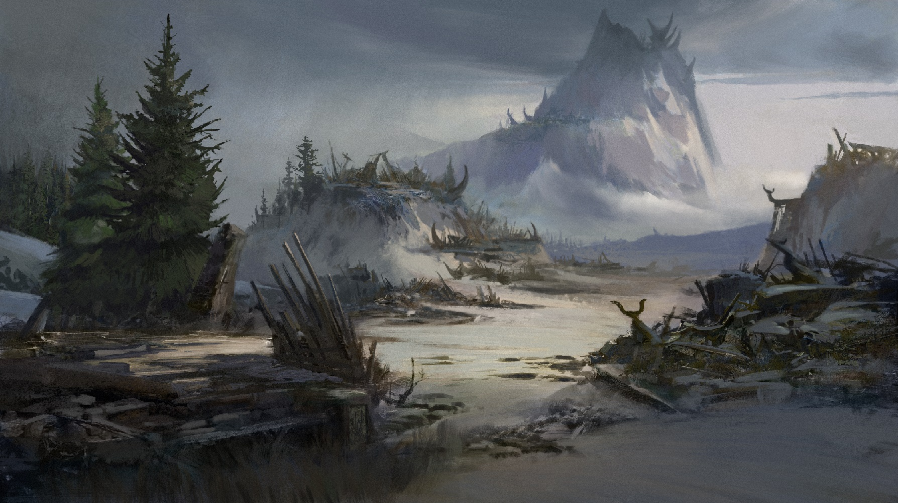

# სესია 1 — ბლიცკრიგი

## თერბისას დაცემა

თერბისას ერთ-ერთ სასტუმრო-დუქანში მძინარენი გამოაღვიძა მძლავრმა ბრაგვანმა,
წივილ-კივილმა და ვიღაცის სიკვდილისწინა ხავილმა. ამონმა ლამის შემოანგრია
ვაიკარისა და კოსმის ოთახის კარები და აუწყა მათ, რომ თერბისას მოულოდნელად
თავს დაესხა ნოქსუსის არმია. მიკრი, ვაიკარი, ბონდრიუდი, კოსმი, კიმჩი, მამუ
და დარიუსი მალევე ჩაბარგნენ და გაჰყვნენ ამონს, რომელიც ირწმუნებოდა, რომ
უსაფრთხო გასასვლელი იცოდა. მართლაც, განავლით აღსავსე კანალიზაციის
გავლით მიმავალ გუნდს თავიდან საფრთხე არ შეხვედრია, მაგრამ როგორც კი
თავი ქალაქის ერთ-ერთ კარიბჭესთან ამოყვეს, გადაეყარნენ 3 ნოქსუსელ მაგიკოსსა
და 3 მეომარს, რომლებიც იქვე მდგარ კარეტებს ყარაულობნენ, არავინ გაიქცესო. 

ნოქსუსელებმა თავიდანვე აგრესია გამოიჩინეს… მიკრმაც არ დააყოვნა და შეება
ერთ-ერთ მეომარს, წაეჭიდავა, მაგრამ ძვრა ვერ უყო. ამ უსუსურობის
შემხედვარე ბონდრიუდი მივარდა უახლოს მაგიკოსთან და თავისი ხანჯლით
მოხანჯლა იგი, რის შემდეგაც ამავე ნოქსუსელმა ხელებით მიწა ცეცხლის
ალში გაახვია. აღმოჩნდა, რომ ეს მაგიკოსი არ იყო ერთადერთი ცხელი კაცი ამ
ბრძოლაში, რადგან მამუმ თავისი რკინის ნაგლეჯისებრი ხმალი გაწითლებამდე
გააცხელა და ეს გავარვარებული საშინელება ერთ-ერთ მაგიკოსს არაადამიანური
ძალით მოუქნია, რითაც იგი ძლიერ დაასახიჩრა, მაგრამ ვერ მოკლა. ამასობაში,
ვაიკარმა, მცოდნემ ყველაფრისა, დააძრო რამდენიმე რელიკვია და მის გარშემო
მდგარი გუნდელები აღავსო სიცოცხლისმომგვრელი ენერგიით. კოსმმა დაინახა,
რომ ბრძოლა მისი თანამებრძოლეების სასარგებლოდ ვითარდებოდა და
გადაწყვიტა, მაგიური ენერგიის კონცენტრაცია გაეკეთებინა და საჩვენებელი
თითიდან გადაესროლა შორს მდგარი მეომრისკენ, რომელსაც ეს ენერგია
მართლაც რომ გადაესტყნა თავზე… კოსმი სხვა მეომარმა შენიშნა, ეს რა დღეში
არისო, მიუახლოვდა და მას პირდაპირ ღდიდში გაარჭო ხმალი. კოსმის
გაპობის შემყურე მაგიკოსმა ჯერ ჩაიცინა იხიდნურად, შემდეგ გამოიძახა 
ვეებერთელა ცეცხლოვანი გველი. ამასობაში მიკრს ერთმა არბალეტიანმა
მეომარმა შორიდან ბოლტი გაარტყა… საბედნიეროდ, ღდიდს ააცილა. 
მამუს შიშით კუდამოძუებულმა მაგიკოსმა გამბედაობა მოიკრიბა და
წარმოთქვა რაღაც შელოცვა, რომლითაც ვინმე “გენერალს” სთხოვდა
დახმარებას. მიუხედავად ამისა, ვაიკარის ხელის გულში დაგროვდა
მკრეხელური ენერგია, რომელიც მან ერთ-ერთ მეომარს პირში მისცა.
ასევე ფეკალიით სავსე ფიალაც ესროლა. ბრძოლის ველზე მოთარეშე
ცეცხლოვანი გველი საკუთარ თავს არავის ავიწყებდა… წავიდა, დაუარა
კოსმს, ამონსა და კიმჩის, გადაბუგა ისინი. ამონი, როგორც
ცხოვრებისეულად დაღლილი და გამწყრალი პიროვნება, წამოდგა
და ცეცხლოვანი ბურთი დაანარცხა იქ, სადაც ყველაზე მეტი
ნოქსუსელი იდგა. მამუმ და ერთმა ნაჯახიანმა მებრძოლმა ერთმანეთი
აიყვანეს სამიზნეში და გამართეს ე.წ. ლამერლენდი, ანუ აცილებათა
კასკადი აქამდე უხილავი ბეჩავობისა. ამონის დაღლა პიკს აღწევდა… 
ის იმდენად დაღლილი იყო ამ განგრენისმქმნელი არსებობით, რომ
პირდაპირ დააძრო რამდენიმე ფიალა და თავის გარშემო დაასხა მათი შიგთავსი.
ამონის ამ ქმედებამ რაღაც ეფექტის მოლოდინი გააჩინა…

## უცნაური ტელეპორტი

ვინმე “გენერალი”, რომელიც ერთმა შეშინებულმა მაგიკოსმა მოიხმო,
გამოჩენილიყო ბრძოლის ველზე - გენერალი არმსტრონგი, როგორც
ყველამ მოგვიანებით შეიტყო. მამუსთვის რომ გეკითხათ, ეს უზარმაზარი,
კუნთიანი და გველეშაპისებრი ადამიანი არც კი ჩანდა, ამიტომაც
მან გააგრძელა ნაჯახიან მეომართან გამართული ლამერლენდი, მაგრამ
ამჯერად, როგორც იქნა, ჩაბრიდა იგი. რაც შემდეგ მოხდა, მამუს სრული
ყურადღება მიიქცია… ამონის მიერ დასხმული სითხე ორთქლად ქცეულიყო,
რომლიდანაც ვიღაც ადამიანმა გამოაბიჯა. ნუთუ, ეს უცნაური ტელეპორტი იყო… 
ამგვარი ტელეპორტის შემძლე მამუს მხოლოდ მამბო ეგულებოდა, რომელიც
გაუჩინარებულიყო დიდი ხნის წინ. ამონის რიტუალიდან ახლად გაჩითული
ადამიანი შმაგივით გავარდა, პირდაპირ არმოსტრონგს ეტაკა და წამის
მეასედის განმავლობაში მას მილიარდჯერ გლიჯა… არმსტრონგი ამ დარტყმებს
არც კი შეუქანავებია. ამ კაცს შეუქანავებელმა არმსტრონგმა სულ მიწა ახეხინა
ცხვირით, შემდეგ კი ჩაბრიდა. ამონმა განსჭვრიტა, რომ არმსტრონგი ზედმეტად
ძლევამოსილი იყო და მისი შექანავების შანსი არ იყო, ამიტომაც დრო
იხელთა და მოახტა ეულ კარეტას, სხვებსაც მოუხმო და მალევე განარიდა ბრძოლის ველს.

## სანაპიროსკენ

ბრძოლით დაღლილი გუნდი ორი დღე მიემგზავრებოდა ნოქსუსის საზღვრისკენ,
სანაპიროსკენ, რომელიც ებჯინება ოკეანეს და ყველა სოფელი რომელიც კი გზაში
გამოჩნდა, დაჩაჩანაკებული და დაოხრებული იყო. ეს იყო ნოქსუსელთა სწრაფი
ბრძოლის, ანუ ბლიცკრიგის სავალალო შედეგი. ისინი ერთ ღამეში მთლიან სილვერმერს დაუფლებოდნენ. 

კარეტაში მჯდარმა ვაიკარმა მოპირდაპირედ წამოწოლილ ამონს მოყავისფრო
სითხის შემცველი ფიალა მიაწოდა, უთხრა, დალიე, კარგიაო. ამონმაც ამოიოხრა
ღრმად და მოიყუდა ფიალა, მაგრამ მალევე არწყია ზედ ვაიკარის ლამაზ ტანისამოსზე.

ბონდრიუდმა, რომელიც აქობამდე ძილ-ბურანში იყო გახვეული, გაიღვიძა და
ეგრეთვე დაიწყო ლაპარაკი, რომ ბორდელი აუცილებლად იყო შესაქმნელი ამ მიდამოებში.
მიკრს ეს იდეა გაეჩხირა, ვითარც მახათი ღდიდში… ამ ორის სიტყვიერმა შელაპარაკებამ
ე.წ. თრახის ალბათობა გაზარდა, რაც ამონმა განსჭვრიტა და ადრევე მოიმოქმედა 
რაღაც პროჭული შელოცვა, რომელმაც მოჩხუბრები და არამარტო დააძინა. 
აღმოჩნდა, რომ ამონი არც ისე დაღლილი იყო… რადგან სანამ გუნდს ეძინა,
ათი ადამიანი აიყვანა: უმეტესობა ბრძოლისუნარიანი კაცი, რამდენიმე ქალი
და ერთი ბავშვი. ვაიკარი თურმე რაღაც დროით ადრე გამოსულიყო ამონის
შელოცვიდან, დრო უხელთია და ბონდრიუდის სისხლი აუღია სინჯად. 

როგორც კი ყველამ გაიღვიძა, მამუმ ახალმოსულებს გააცნო, რომ გაძევებული
პრინცია, რომელიც საკუთარი ძმის, ვულტის ტახტიდან ჩამოსაგდებად ემზადება
და პირდაპირ ქალებს შორის მოკალათდა. აღმოჩნდა, რომ ბონდრიუდის ვულტს ემტერება.

ზედმეტად გადავსებული კარეტა დაშლის პირად იყო, მაგრამ, საბედნიეროდ, 
დანიშნულების ადგილამდე გაძლო და გუნდი დანვოლამდე მიიყვანა, 
ანუ იმ ოკეანისპირა ქალაქამდე, რომელიც ნოქსუსმა 100 წლის წინ დაანგრია. 
ამ ქალაქის მდებარეობა სტრატეგიუილად ხელსაყრელი იყო, რადგან ის
დავიწყებას მიეცა დიდი ხნის წინ და ნოქსუსელთა ყურადღების მიღმა იყო.

ახლებთან საუბრისას ამონმა რამდენჯერმე ახსენა "ორგანიზაცია" და მამუს კითხვასაც,
თუ რა არის ეს, გასცა პასუხი - "მზერგრძელნი", შემდეგ კი მოიხსნა ნიღაბი და გამოაჩინა
ნაიარევი, რომელიც თხემიდან ნიკაპამდე გადაჭიმულიყო, "ნდობა ორმხრივი უნდა იყოს" - 
განაცხადა მან.

აღმოჩნდა, რომ ამონი "ინფორმატორებთან" იყო წასასვლელი, და მისი არყოფნის
ერთ კვირაში, როგორც თავადვე დააბარა გუნდს, დანვოლის ტერიტორია უნდა
გაშენდეს და "სერიოზული საქმისთვის" გამზადდეს. წასასვლელად გამზადებულ
ამონს ბონდრიუდმა თავი "X და 0" თამაშის წესების სწავლით მოაბეზრა, 
ნოქსუსელების ჯარი, მისი ჭკუით, ამ თამაშში გაერთობოდა და ბრძოლის თავიც
აღარ ექნებოდა. ვაიკარიც თავისებურად დაემშვიდობა ამონს, "ადამიანს ორი სული გააჩნია,
შენ ორსული ხარ..." - ასეთი რამ უთხრა.

"მე ერთსული ვარ" - უპასუხა ამონმა და თვალს მიეფარა.

